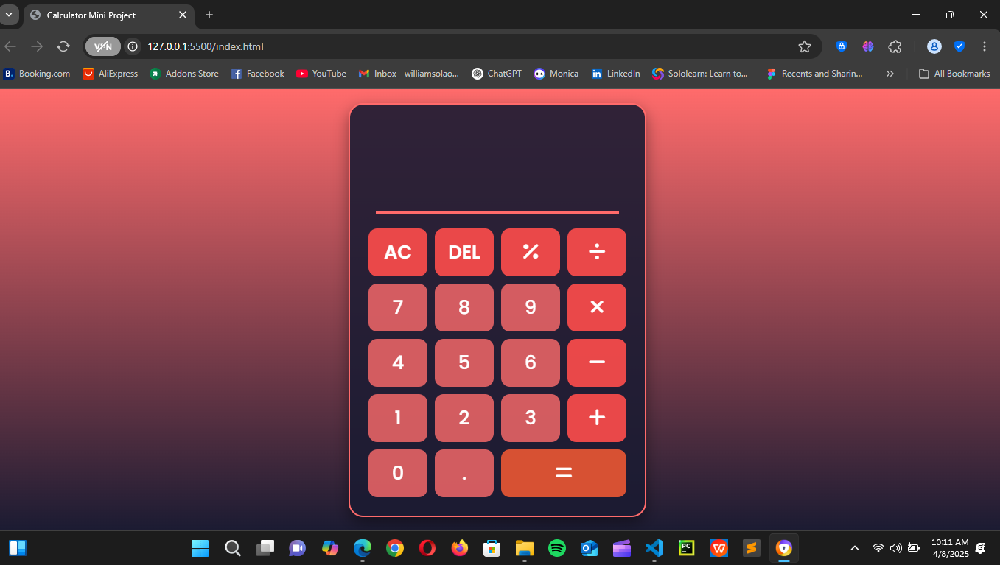

# 🧮 Calculator Website

A simple, responsive calculator web application built for basic arithmetic operations.

## 🚀 Features

- Perform addition, subtraction, multiplication, and division
- Clean and intuitive user interface
- Responsive design for mobile and desktop
- Keyboard input support (optional)
- Built with **HTML**, **CSS**, and **JavaScript**

## 📸 Screenshots

<!-- You can add screenshots or demo GIFs here -->
<!-- Example: -->
<!--  -->

## 🛠️ Technologies Used

- HTML5  
- CSS3  
- JavaScript (Vanilla JS)

## 🧑‍💻 How to Run Locally

1. Clone the repository:
   ```bash
   git clone https://github.com/your-username/calculator-website.git

Navigate to the project directory:

bash
Copy
Edit
cd calculator-website
Open index.html in your browser.

📂 Project Structure
pgsql
Copy
Edit
calculator-website/
├── index.html
├── style.css
├── script.js
└── README.md
✅ Future Improvements
Add scientific calculator features

Add light/dark theme toggle

Support for keyboard shortcuts

Save calculation history

🙌 Acknowledgements
Thanks to online tutorials and developer communities for inspiration

📄 License
This project is licensed under the MIT License.
